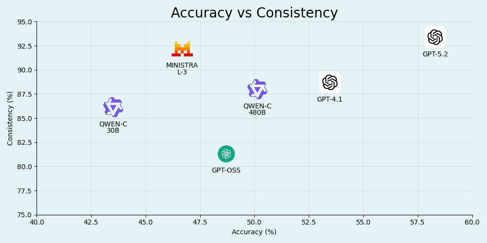
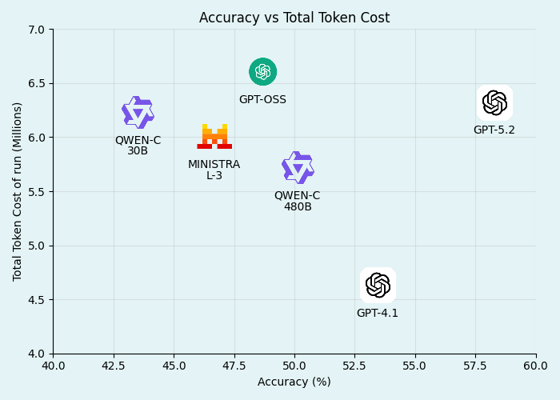
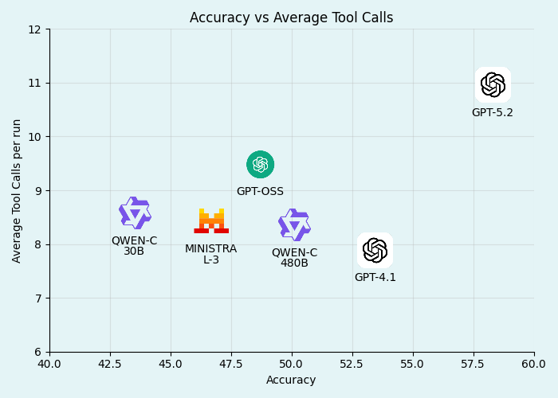
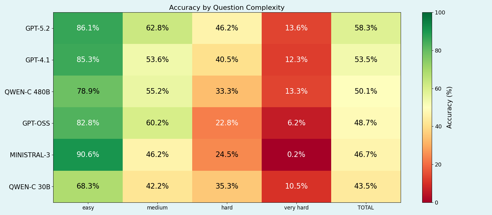
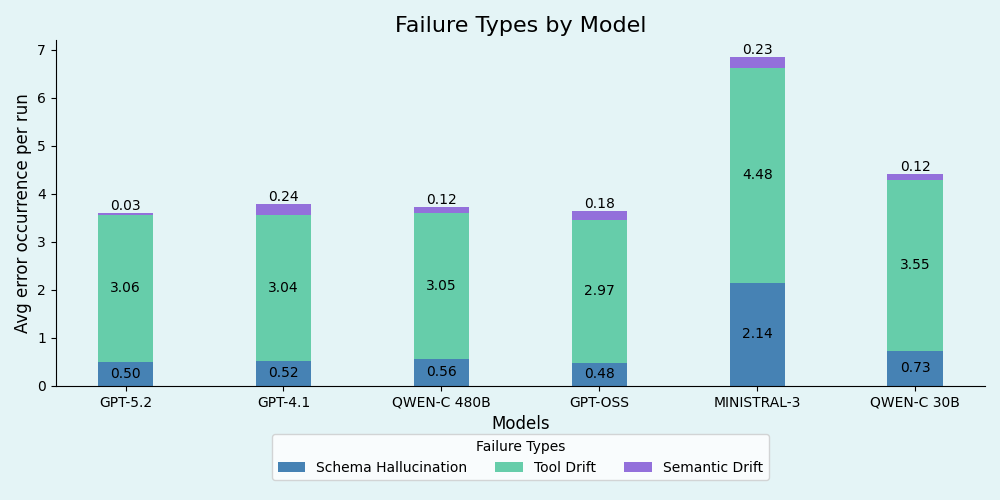

# DOREMUS Music Knowledge Graph - MCP Server

A **Model Context Protocol (MCP)** server for agentic retrieval over SPARQL-based Knowledge Graphs (DOREMUS by default). The server exposes a small set of **ontology-agnostic tools** (entity discovery, query building, filtering, execution) that an LLM can call to iteratively construct valid SPARQL.

> While primarily tested with DOREMUS (https://data.doremus.org), this codebase is designed to be adapted to any SPARQL endpoint by changing configuration + query templates.

---

## Goals

### 1) Agentic retrieval over Knowledge Graphs (via MCP)

Provide an MCP server that lets an LLM:

- resolve entities (e.g., composers, works),
- build SPARQL step-by-step,
- execute queries robustly (timeouts, retries, safety checks),
- avoid schema hallucinations by constraining actions to tools/templates.

Core entrypoint: [`src.server.main`](src/server/main.py) (FastMCP server + tool registration).

### 2) Template-driven, ontology-agnostic query construction

Use reusable `.rq` templates + strategies to map user intent to graph patterns and keep the tool API stable across ontologies.

Template engine: [`server.template_parser`](src/server/template_parser.py)  
Query state builder: [`server.query_container.QueryContainer`](src/server/query_container.py)

### 3) Reproducible evaluation + ablations

Run evaluation experiments (LangSmith-backed) and produce plots for:

- accuracy,
- cost/latency tradeoffs,
- accuracy by question complexity,
- error type breakdown,
- tool-configuration comparisons,
- sampling/dry-run ablations.

Evaluation runner: [`evaluators.test_query`](evaluators/test_query.py)  
Analysis: [`evaluators.analyze_runs`](evaluators/analyze_runs.py)  
Plot generation: [`evaluators.create_plots`](evaluators/create_plots.py)

---

## Overall Project Structure

```
DOREMUS_MCP/
├── src/
│   ├── server/                         # MCP server implementation
│   │   ├── config/                     # Endpoint + tool + strategy config + templates
│   │   │   ├── templates/              # SPARQL templates (.rq)
│   │   │   ├── server_config.yaml
│   │   │   ├── strategies.yaml
│   │   │   └── tools.yaml
│   │   ├── main.py                     # FastMCP server + tools (HTTP routes, tool gating)
│   │   ├── tools_internal.py            # Tool implementations + query storage
│   │   ├── template_parser.py           # Template loading/validation
│   │   ├── query_container.py           # QueryContainer state machine + dry-run checks
│   │   ├── graph_schema_explorer.py     # Schema exploration helpers
│   │   └── utils.py                     # SPARQL execution, URI validation, helpers
│   └── rdf_assistant/                   # LangChain client/agent (used by evaluators)
│       ├── doremus_assistant.py
│       ├── extended_mcp_client.py
│       ├── prompts.py
│       └── eval/
│           ├── doremus_dataset.py       # Loads local .rq dataset files
│           └── split_dataset.py         # Computes complexity splits via hop-count heuristic
├── evaluators/                          # Evaluation pipeline scripts
│   ├── test_query.py                    # Main evaluation entry (LangSmith dataset -> runs -> metrics)
│   ├── analyze_runs.py                  # Extracts traces + metrics into experiments/*.json
│   ├── create_plots.py                  # Generates plots into data/evaluation/plots/
│   ├── run_tool_study.py                # Tool-config sweep (enables/disables tool subsets)
│   ├── run_ablation_study.py            # Sampling/dry-run ablation
│   ├── test_gemini_dataset.py           # Gemini CLI-based runner (optional)
│   └── export_human_readable.py         # Converts analysis JSON to readable .txt
├── eval_dataset/                        # Local dataset of .rq files (questions + gold SPARQL + metadata)
├── experiments/                         # Output folder for analysis JSON (from analyze_runs.py)
├── data/
│   ├── graph.csv                        # Graph used by path-finding tooling
│   └── evaluation/plots/                # Generated figures (see "Results" section)
├── docs/                                # Documentation & paper PDF
├── tests/                               # Unit tests
├── Dockerfile / docker-compose.yml
└── pyproject.toml
```

---

## How it Works (High-Level)

### MCP server + tool gating

Tools are registered in [`src.server.main`](src/server/main.py) and can be enabled/disabled via `MCP_ENABLED_TOOLS` (CSV). This is used for tool studies (ablations).

### Query building is stateful

Each run manipulates a server-side query state stored in [`server.tools_internal.QUERY_STORAGE`](src/server/tools_internal.py) using [`server.query_container.QueryContainer`](src/server/query_container.py).

### Safety: Dry-run checks (optional)

Before fully executing, queries can be sanity-checked using [`server.query_container.QueryContainer.dry_run_test`](src/server/query_container.py) which can be disabled with `ENABLE_DRY_RUN=false`.

---

## Evaluation Pipeline

The typical flow is:

1. **(Optional) compute/refresh question splits** (complexity via hop counting):  
   [`src.rdf_assistant.eval.split_dataset`](src/rdf_assistant/eval/split_dataset.py)

2. **Upload dataset to LangSmith** (deletes/recreates):  
   [`evaluators.create_dataset`](evaluators/create_dataset.py)

3. **Run evaluation** (agent calls MCP tools; metrics computed):  
   [`evaluators.test_query`](evaluators/test_query.py)

4. **Analyze traces** into a compact JSON for plotting:  
   [`evaluators.analyze_runs`](evaluators/analyze_runs.py)

5. **Generate plots** into `data/evaluation/plots/`:  
   [`evaluators.create_plots`](evaluators/create_plots.py)

Evaluator documentation: [evaluators/README.md](evaluators/README.md)

---

## Results (from `data/evaluation/plots/`)

The repository includes a plotting pipeline that summarizes experiments into figures. The images below are loaded from `data/evaluation/plots/` and are intended to be the “paper-style” summary of the experiments.

### Accuracy vs Consistency

This plot should be read as **evidence that the framework constrains stochasticity**, not that all models “reason equally well”.

- The paper defines a **Consistency Score** as a clipped inverse standard deviation across repeated runs (three independent experiments; three runs per question):  
  Consistency = clip(1.0 − 2.0 × σ_question, 0.0, 1.0)
- The reported range (**~82%–93%**, baseline >80%) is interpreted as validating the **Query Container** approach: syntax constraints + tool-side “dry runs” offload structural validity from the LLM.
- Consequently, when accuracy drops, the paper attributes it primarily to **reasoning limitations on complex questions**, rather than random syntax/tool hallucinations.



---

### Accuracy vs Token Cost

This plot illustrates the **compute trade-off of agentic retrieval** (accuracy is not “free”).

- High-reasoning generalist models (example given: **gpt-4.1**) tend to be more **tool-efficient**, using fewer tool calls to isolate the correct schema path.
- “Thinking models” (example given: **gpt-5.2**) explicitly trade **token efficiency for higher accuracy**, increasing inference-time compute (and therefore cost/latency), consistent with “reasoning scales with inference-time compute”.
- Specialized coder models can reach comparable accuracy with fewer parameters by relying more heavily on the **iterative feedback loop**, but may incur **token overhead**.



---

### Accuracy vs Latency (Avg Tool Calls)

The paper treats “latency” here as an **iteration/interaction proxy** rather than wall-clock time.

- The core takeaway is an **iteration trade-off**: some models converge quickly with fewer calls, while others require more iterations (and more tokens) to reach similar accuracy.
- A notable behavior in smaller agile models (example: **ministral-3:14b**) is **parallel tool invocation (“batch calling”)**, which reduces sequential exploration time by testing multiple schema hypotheses at once.
- In contrast, other architectures can show high resource consumption because they depend strongly on the feedback loop to converge.



---

### Accuracy by Question Complexity

This heatmap is used to argue that **hardness is dominated by reasoning depth**, especially for aggregation and multi-hop traversal.

- Top-performing models define an **“interpretability limit”** of the current agentic framework (the paper mentions ~**85% on Easy**), meaning remaining errors reflect framework limits (e.g., missing tools, ambiguous tool definitions, insufficient feedback granularity) more than hallucination.
- The paper highlights a **sharp drop** in Hard/Very Hard strata, motivating the need for **high inference-time compute** for analytical (aggregation) and generative (multi-hop) queries.
- Parameter count correlates positively with final accuracy in Hard/Very Hard, but specialization matters: coder models can look more **uniform across strata** because some “Hard” queries are syntactically pattern-like (e.g., GROUP BY), yet scale still improves tool-use precision (bigger coder > smaller coder).
- “Thinking models” are reported to help with **variable conflicts** and **aggregation scoping**, where standard models often conflate paths or group by the wrong entity.



---

### Failure Types by Model

The stacked bars are framed as a **semantic failure taxonomy**, because syntax errors are largely eliminated via execution-based validation (“dry runs”).

- **Type II (Tool Drift)** is reported as the dominant error mode: models often understand intent (low Type III) and vocabulary (low Type I) but struggle to choose the most efficient/appropriate tool strategy.
- **Type I (Schema Hallucination)** is minimal for reasoning-capable models (examples: gpt-5.2, qwen-480b), supporting the claim that tool definitions + constraints reduce schema invention.
- **Type III (Semantic Drift)** is described as notably low across architectures; when it occurs, it’s often “format divergence” (e.g., URIs vs labels) rather than misunderstanding the user’s question.
- The paper calls out **ministral-3:14b** as an outlier with higher Type I due to a trade-off: it compensates for limited reasoning by aggressive **parallel exploration**, but loses semantic precision (more hallucinated parameters/hypotheses).



---

### Tool configuration study (incremental tool contribution)

This figure is explicitly used to validate that **tooling is not just convenience—it is necessary** for DOREMUS-level ontologies.

- Baseline “advanced tools denied” is presented as evidence that unrestrained **Explorative-Generative workflows** (ontology exploration + one-shot query generation) are insufficient; DOREMUS requires a dynamic, multi-step agentic approach.
- The biggest gains come from **Build Query (BQ)** and **Add Filter (AF)**:
  - Templates reduce hallucination by encoding basic RDF patterns.
  - BQ’s internal “light classifier” is credited with routing to the right template strategy (e.g., Artist vs Expression), providing a stable skeleton.
- Adding **Filter By Quantity (FBQ)** yields another large gain by abstracting temporal/numeric patterns (date ranges, ISO-8601 durations) that commonly cause syntax errors in direct generation.
- **Add Component Constraint (ACC)** is described as structurally critical: it implements the “Neighborhood Retrieval” strategy via recursive/pathfinding logic, letting the agent prune schema and select relevant subgraphs (e.g., instrumentation).
- Advanced “write-access” tools introduce a **reasoning threshold**:
  - For high-reasoning models (example: gpt-4.1), **Groupby Having (GH)** and **Add Triplet (AT)** help handle edge cases and add ~**+5%** final accuracy.
  - For lower-reasoning architectures (example: qwen3-coder 30b), enabling these tools can **degrade performance** because increased agency leads to misuse and semantic errors.


---

## Reproducing the Plots

Assuming the MCP server is running and LangSmith is configured:

```bash
# 1) Run evaluation experiments (writes runs to LangSmith)
poetry run python evaluators/test_query.py

# 2) Export a compact JSON into ./experiments/
poetry run python evaluators/analyze_runs.py "<YOUR_LANGSMITH_PROJECT_NAME>"

# 3) Generate plots into data/evaluation/plots/
poetry run python evaluators/create_plots.py
```

Tool-study sweep:

- [`evaluators.run_tool_study`](evaluators/run_tool_study.py)

Sampling / dry-run ablation:

- [`evaluators.run_ablation_study`](evaluators/run_ablation_study.py)  
  Dry-run behavior: [`server.query_container.QueryContainer.dry_run_test`](src/server/query_container.py)

---

## Quick Start

### Using Docker

```bash
docker-compose up --build
```

Server URL (default):

- `http://localhost:8000/mcp`

### Local Development (Poetry)

```bash
poetry install
poetry run python -m src.server.main
```

Evaluators/client dependencies:

```bash
poetry install --with eval
poetry run python evaluators/test_query.py
```

---

## License / Support

This MCP server implementation is provided as-is for accessing the publicly available DOREMUS Knowledge Graph.

For issues related to:

- **This MCP server**: open an issue in the repository
- **DOREMUS data/ontology**: contact the DOREMUS project
- **SPARQL endpoint**: https://data.doremus.org/sparql/
